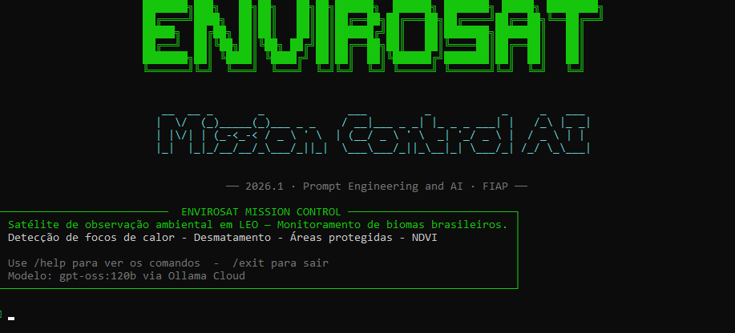
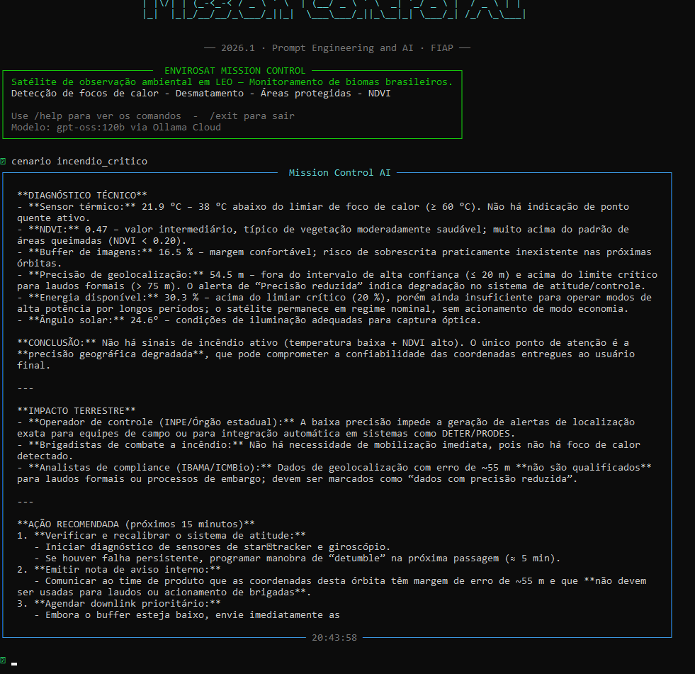

#  EnviroSat Mission Control AI

Sistema de monitoramento operacional de satélite de observação ambiental com análise em linguagem natural via IA generativa. O sistema detecta focos de calor, desmatamento e anomalias operacionais em tempo real, traduzindo cada dado técnico do satélite em impacto terrestre compreensível para operadores, brigadistas e analistas ambientais.

##  Integrantes

| Nome | RM | Turma |
|------|-----|-------|
| Pedro Ferreras | 568713 | 1CCPI |
| Pedro Santos | 571017 | 1CCPI |

**Modalidade**: Dupla  
**Disciplina**: Prompt Engineering and Artificial Intelligence  
**Curso**: Ciência da Computação — FIAP  
**Global Solution**: 2026.1 — Trilha  EnviroSat

---

##  O que o projeto faz

O **EnviroSat Mission Control AI** simula a operação de um satélite de observação ambiental em órbita baixa (LEO), monitorando continuamente 5 parâmetros críticos:

- **Sensor Térmico** — detecta focos de calor acima de 60°C (possível incêndio ativo)
- **NDVI** — índice de vegetação; valores abaixo de 0.2 indicam queimada ou desmatamento severo
- **Buffer de Imagens** — percentual de imagens não transmitidas; acima de 90% há risco de perda de dados
- **Precisão de Geolocalização** — acima de 75m, dados não são válidos para laudos ambientais
- **Energia Disponível** — abaixo de 20%, modo de economia é ativado automaticamente

A IA generativa (gpt-oss:120b via Ollama Cloud) interpreta os dados, detecta padrões de risco e explica em linguagem natural o que cada anomalia significa para quem precisa agir na Terra.

---

##  Persona atendida

O sistema atende **três personas** com linguagem adaptada a cada contexto:

1. **Operador do Centro de Controle** (INPE / órgão estadual): análise técnica com métricas e recomendações operacionais imediatas.
2. **Coordenador de Brigada de Incêndio**: linguagem direta e clara — "há fogo na sua região? Você precisa mobilizar equipe agora?"
3. **Analista de Compliance Ambiental** (IBAMA / ICMBio): indicação precisa de confiabilidade dos dados para laudos e processos de fiscalização.

---

##  Tecnologias utilizadas

- **Python 3.10+**
- **Ollama Cloud API** — modelo `gpt-oss:120b`
- **Rich 15.0.0** — painéis, tabelas e spinners no terminal
- **prompt-toolkit 3.0.52** — input editável com histórico
- **pyfiglet 1.0.4** — banner ASCII art
- **python-dotenv 1.2.2** — gerenciamento seguro de credenciais

---

##  Como executar

```bash
# 1. Clone o repositório
git clone https://github.com/pFerreras0203/EnviroSat_missionControl.git
cd mission-control-ai

# 2. Crie e ative o ambiente virtual
python -m venv .venv
source .venv/bin/activate        # Linux/Mac
.venv\Scripts\activate           # Windows

# 3. Instale as dependências
pip install -r requirements.txt

# 4. Configure as credenciais
cp .env.example .env
# Edite .env e insira sua chave Ollama Cloud:
# OLLAMA_API_KEY=sua_chave_aqui

# 5. Execute o sistema
python main.py
```

### Comandos disponíveis na CLI

| Comando | Descrição |
|---------|-----------|
| `/help` | Exibe tabela de comandos |
| `/status` | Leitura atual de telemetria (sem IA) |
| `/cenario <nome>` | Simula cenário pré-definido |
| `/about` | Informações do projeto e equipe |
| `/clear` | Limpa tela e reexibe banner |
| `/exit` | Encerra o sistema |
| `[qualquer texto]` | Consulta a IA com dados de telemetria atuais |

### Cenários de teste disponíveis

```bash
# Na CLI, após iniciar com python main.py:
/cenario nominal
/cenario incendio_critico
/cenario energia_baixa
/cenario buffer_cheio
/cenario multipla_falha
```

---

##  Demonstração




---

##  System Prompt

O system prompt completo está em [`prompts/system_prompt.md`](prompts/system_prompt.md).

**Destaques do prompt:**
- Define 3 personas (operador, brigadista, analista de compliance) com linguagem adaptada
- Instrução explícita de conectar análise técnica → impacto terrestre → ação concreta
- 3 exemplos few-shot (incêndio crítico, nominal, energia baixa) para guiar o modelo
- Regras absolutas de comportamento (ex: nunca minimizar anomalias combinadas)
- Contexto operacional do EnviroSat-1 (órbita, sensores, clientes dos dados)

---

##  Cenários de teste demonstrados

| Cenário | O que testa | Nível esperado |
|---------|-------------|----------------|
| `nominal` | Operação normal, sem alertas | NOMINAL |
| `incendio_critico` | Foco de calor + NDVI crítico simultâneos | CRÍTICO |
| `energia_baixa` | Bateria abaixo de 20%, modo economia ativado | CRÍTICO |
| `buffer_cheio` | Buffer em 93.5%, risco de perda de imagens | CRÍTICO |
| `multipla_falha` | 4 parâmetros críticos ao mesmo tempo | CRÍTICO |

---

##  Proposta de valor / modelo de negócio

### 1. Qual o problema real terrestre que esta missão resolve?

O Brasil perde em média **1,5 milhão de hectares de Amazônia por ano** para desmatamento e incêndios. O tempo entre a detecção de um foco de calor por satélite e a mobilização de uma brigada pode chegar a 6–12 horas quando o fluxo de dados não é otimizado. O EnviroSat Mission Control AI reduz esse gap: transforma dados brutos de telemetria em alertas acionáveis em linguagem natural, eliminando a necessidade de um especialista em processamento de imagens no loop de decisão imediata.

### 2. Quem paga pela solução?

Modelo híbrido público-privado:
- **Setor público**: IBAMA, INPE, ICMBio e Secretarias Estaduais de Meio Ambiente contratam o sistema como camada de inteligência sobre dados do CBERS/Amazônia-1 — similar ao que hoje é feito manualmente por analistas.
- **Setor privado**: Seguradoras rurais (como Fairfax, Swiss Re) que subscrevem apólices de seguro agrícola baseadas em índice de satélite pagam por acesso à API de alertas qualificados. Empresas do mercado de carbono (Verra, Gold Standard) usam os dados de NDVI para certificação de créditos de carbono.

### 3. Métrica de impacto

Se o EnviroSat-1 operar com 100% de disponibilidade por 1 ano:
- **~85 milhões de hectares** de bioma brasileiro monitorados continuamente (cobertura estimada para órbita LEO com período de 98 min)
- **Tempo de detecção de foco reduzido** de 6–12h para menos de 2h, graças à automação do fluxo de análise
- **~4.000 alertas de foco de calor processados** por ano (média histórica INPE: 11 focos/dia na Amazônia)
- **Redução estimada de 15–25%** no tempo de resposta de brigadas, potencialmente evitando 180.000–300.000 hectares adicionais de perda florestal por ano
- **Dados qualificados para laudos ambientais** em 100% das passagens com geolocalização < 50m — hoje parte dos dados é descartada por imprecisão

### 4. Modelo de negócio

**Dado-como-serviço (DaaS) + SaaS de análise**:
- **Nível 1 (governo)**: Concessão pública — INPE e IBAMA pagam licença anual pelo sistema de análise em cima dos dados já coletados pelo CBERS/Amazônia-1.
- **Nível 2 (privado)**: API de alertas qualificados vendida como SaaS para seguradoras e empresas de carbono — modelo de assinatura mensal por região monitorada.
- **Nível 3 (futuro)**: White-label do Mission Control AI para operadoras de constelações privadas nacionais (Visiona, Akaer) que precisam de camada de inteligência sobre seus dados brutos.

---

##  Limitações conhecidas

- **Dados simulados**: A telemetria é gerada por algoritmo, não por satélite real. Os ranges e thresholds são baseados em literatura pública de missões como Amazônia-1 e Landsat, mas não representam dados operacionais reais.
- **Consistência do LLM**: Modelos de linguagem são não-determinísticos. A mesma entrada pode gerar respostas ligeiramente diferentes. O system prompt com exemplos few-shot foi calibrado para estabilizar os outputs, mas variações ocorrem.
- **Latência da API**: Chamadas ao gpt-oss:120b via Ollama Cloud podem levar 5–15 segundos dependendo da carga do servidor. Não há cache implementado nesta versão.
- **Sem georreferenciamento real**: O sistema reporta "área imageada nesta passagem" de forma genérica — não há integração com coordenadas reais de órbita.

---

##  Vídeo de demonstração

🔗 [Assistir demonstração no YouTube](https://www.youtube.com/watch?v=SEU_ID_AQUI)

